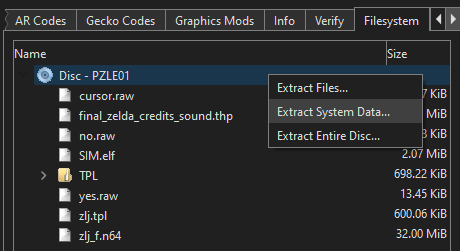
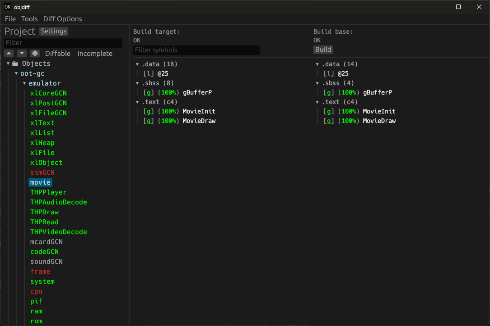

[![Discord Badge]][discord]
=============

[Discord Badge]: https://img.shields.io/discord/688807550715560050?color=%237289DA&logo=discord&logoColor=%23FFFFFF
[discord]: https://discord.zelda64.dev

A work-in-progress decompilation of the N64 emulator intended for use with the GameCube releases of The Legend of Zelda: Ocarina of Time.

This repository does **not** contain any game assets or assembly whatsoever. An existing copy of the game is required.

Supported versions:

- `MQ-J`: Master Quest - JP
- `MQ-U`: Master Quest - US
- `CE-J`: Collector's Edition - JP
- `CE-U`: Collector's Edition - US
- `CE-P`: Collector's Edition - PAL

The progress of this project will be synced with the main repo: [zeldaret/oot-gc](https://github.com/zeldaret/oot-gc).

Dolphin SDK code was matched thanks to these projects:
- Dolphin SDK decompilation: https://github.com/doldecomp/dolsdk2001
- Metroid Prime: https://github.com/PrimeDecomp/prime
- Mario Kart Double Dash: https://github.com/SwareJonge/mkdd
- Pikmin 2: https://github.com/projectPiki/pikmin2

Dependencies
============

Windows
--------

On Windows, it's **highly recommended** to use native tooling. WSL or MSYS2 are **not** required.  
When running under WSL, [objdiff](#diffing) is unable to get filesystem notifications for automatic rebuilds.

- Install [Python](https://www.python.org/downloads/) and add it to `%PATH%`.
  - Also available from the [Windows Store](https://apps.microsoft.com/store/detail/python-311/9NRWMJP3717K).
- Download [ninja](https://github.com/ninja-build/ninja/releases) and add it to `%PATH%`.
  - Quick install via pip: `pip install ninja`

macOS
------

- Install [ninja](https://github.com/ninja-build/ninja/wiki/Pre-built-Ninja-packages):

  ```sh
  brew install ninja
  ```

- Install [wine-crossover](https://github.com/Gcenx/homebrew-wine):

  ```sh
  brew install --cask --no-quarantine gcenx/wine/wine-crossover
  ```

After OS upgrades, if macOS complains about `Wine Crossover.app` being unverified, you can unquarantine it using:

```sh
sudo xattr -rd com.apple.quarantine '/Applications/Wine Crossover.app'
```

Linux
------

- Install [ninja](https://github.com/ninja-build/ninja/wiki/Pre-built-Ninja-packages).
- For non-x86(_64) platforms: Install wine from your package manager.
  - For x86(_64), [wibo](https://github.com/decompals/wibo), a minimal 32-bit Windows binary wrapper, will be automatically downloaded and used.

Building
========

- Extract the TGC file containing the N64 emulator from the disc of the version you want:
  * Master Quest: ``zlj_REGION.tgc``, ``REGION`` being ``j`` for Japan, ``e`` for North America or ``p`` for Europe.
  * Collector's Edition: ``120903_zelda.tgc``

- Clone the repository:

  ```sh
  git clone https://github.com/yanis42/oot-gc-dtk.git
  ```

- Using [Dolphin Emulator](https://dolphin-emu.org), extract the content of the TGC file you extracted earlier to ``orig/[GAMEID]``. Note: you don't need to extract the whole disc, you can use "Extract System Data".



  - To save space, the only necessary files are the following. Any others can be deleted.
    - `sys/main.dol`
- Configure:

  ```sh
  python configure.py
  ```

  To use a version other than `MQ-J`, specify it with `--version` (or `-v`) (example: ``python configure.py -v ce-j``).
- Build:

  ```sh
  ninja
  ```

Visual Studio Code
==================

If desired, use the recommended Visual Studio Code settings by renaming the `.vscode.example` directory to `.vscode`.

Diffing
=======

Once the initial build succeeds, an `objdiff.json` should exist in the project root.

Download the latest release from [encounter/objdiff](https://github.com/encounter/objdiff). Under project settings, set `Project directory`. The configuration should be loaded automatically.

Select an object from the left sidebar to begin diffing. Changes to the project will rebuild automatically: changes to source files, headers, `configure.py`, `splits.txt` or `symbols.txt`.



Project structure
==================

- `configure.py` - Project configuration and generator script.
- `config/[GAMEID]` - Configuration files for each game version.
- `config/[GAMEID]/build.sha1` - SHA-1 hashes for each built artifact, for final verification.
- `build/` - Build artifacts generated by the the build process. Ignored by `.gitignore`.
- `orig/[GAMEID]` - Original game files, extracted from the disc. Ignored by `.gitignore`.
- `orig/[GAMEID]/.gitkeep` - Empty checked-in file to ensure the directory is created on clone.
- `src/` - C/C++ source files.
- `include/` - C/C++ header files.
- `tools/` - Scripts shared between projects.
